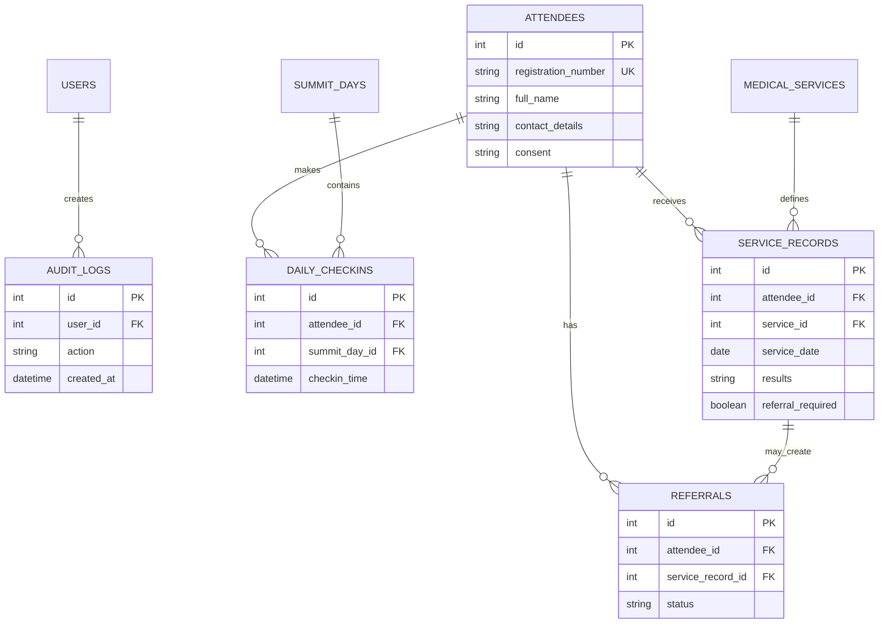

# MUSDAA Medical Camp Data Model

## Module boundaries

- Registration owns attendee identity, consent, and registration cards.
- Check-in owns one unique attendance record per attendee per summit day.
- Medical services owns structured screening results and referrals.
- Reports reads attendance, registration, services, and referrals without exposing public medical data.
- Security owns users, roles, sessions, and audit logs.